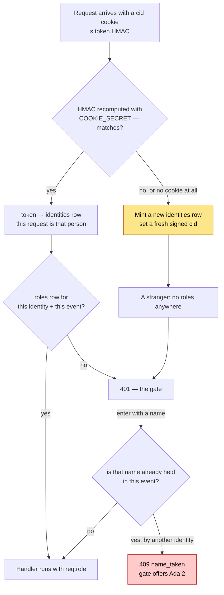
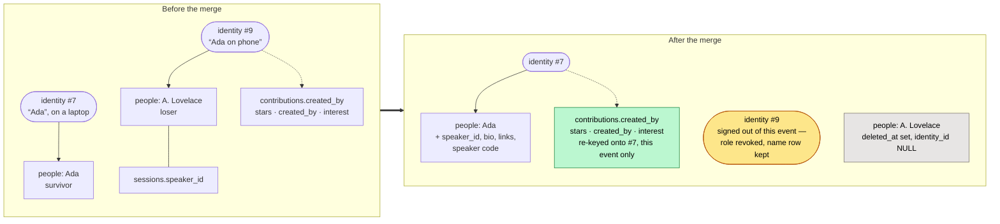

# Architecture

How LibreSesh is put together, and — just as important — what it deliberately
does not do. If you are changing something load-bearing, read the
[Security](#security) section first; several choices that look like gaps are
deliberate, and a few that look harmless are not.

## The shape of it

```
Caddy (:443, automatic HTTPS)
  └── reverse_proxy localhost:3000
        └── one Node process
              ├── Express      API + SSE + static web/dist
              └── better-sqlite3 → $DATABASE_PATH (single file, WAL)
```

One process. One file. No database server, no broker, no queue, no cache. The
whole point is that a conference organiser can run this on a 1 vCPU VPS and back
it up with `cp`.

**Exactly one process may own the database file.** SQLite permits multiple
writers with WAL, but the SSE broker is in-process memory — a second instance
would serve stale schedules to half the room. Never scale the `app` service past
one replica.

## Request path

```
cookie/identity → rate limit → role check → handler → audit + SSE broadcast
```

`server/src/app.ts` wires this in order and the order matters:

- **Identity first**, so even a rejected request is attributable in the audit log.
- **Rate limit before role check**, so password guessing is throttled before it
  can be evaluated.
- **`loadEvent` before `requireRole`**, because a role is per event.
- **`eventAuthRoutes` before `requireRole`** — earning a role has to come before
  requiring one, or the password gate would demand the password it grants.
- **`calendarRoutes` before `requireRole`** — a subscribing calendar app has no
  cookie and authenticates by capability token instead (see below).
- **`/me/link` is global, not event-scoped** — redeeming a link phrase swaps
  the identity cookie itself, so it hangs off `meRoutes` right after the
  identity middleware, before any event exists in the request.

Handlers are synchronous. `better-sqlite3` and `bcryptjs` are both sync, so
Express 4 propagates thrown errors without an async wrapper. `HttpError`
subclasses carry the status and a machine-readable `code`; `errorHandler` shapes
every failure as `{ error: { code, message } }`.

## Data model

| Table | Notes |
| --- | --- |
| `events` | Three bcrypt password hashes, timezone, day viewport, archive flag |
| `identities` | Anonymous cookie token, the display-name seed, optional iCal token |
| `link_codes` | Hashed phrases that adopt an identity: device phrases (single-use, 10 minutes) and admin-minted speaker codes (per person, live until revoked) |
| `event_identities` | `(event, identity) → display name`, unique within the event |
| `roles` | `(identity, event) → viewer\|user\|speaker\|admin` |
| `rooms`, `tags` | Per event, soft-deleted |
| `sessions` | Scheduled: always has a room and a time |
| `proposals` | Pitched: no room, no time, until an organiser places it |
| `people` | Speakers/hosts, optionally claimed by an identity |
| `contributions` | Notes, links, questions; `hidden` for moderation |
| `stars`, `proposal_interest` | Private per-identity interest |
| `audit` | Append-only log of every write |

Times are stored as **UTC ISO-8601 strings**. Every rule that a human would
express in local time — the five-minute snap, the day viewport, the event date
range — is evaluated in the event's IANA timezone via `Intl` in
`server/src/shared/time.ts`. There is no timezone library. Offsets that are not
whole hours (Kathmandu is UTC+05:45) and DST transitions are covered by tests;
do not "simplify" this by comparing UTC minutes.

**Soft deletes everywhere.** `deleted_at` rather than `DELETE`, so an organiser
can undo vandalism (`/trash` and the restore endpoints). A hard delete of a
session would orphan its contributions and stars.

### One database, many events

Every event lives in the same SQLite file, scoped by `event_id`. The obvious
alternative — a database per event — was considered and rejected, because
identity here is deliberately *cross-event*: one signed cookie is one person
across the whole instance, `GET /me` answers with their role in every event,
and the event list is a query. Splitting per event would not remove that shared
state, it would relocate it into a registry database, and then everything that
spans events — the event list, cloning an event's rooms and tags into a new
one, `/trash`, backups, migrations — would have to straddle two connections.

What per-event databases would genuinely buy is isolation, and the isolation
that actually mattered was over names (below), which a schema change bought
outright. Revisit this only if a single instance ever hosts events large or
sensitive enough that physical separation is the requirement — at which point
the answer is probably separate *instances*, not separate files.

### Why a display name belongs to the event, not the identity

A name is how one person is known inside one room. Two unconferences a year
apart have no business fighting over "Ada", so `event_identities` holds the
name and enforces `UNIQUE(event_id, display_name)`;
`identities.display_name` is demoted to the seed a newcomer is offered, and
follows whatever name they last chose.

Global uniqueness was the tempting one-line version — a `UNIQUE` index and a
check in `PATCH /me` — and it is worse than the bug it fixes. It makes the
first person to type a name the owner of it across every event on the instance
forever, including identities nobody uses any more, and it means entering an
event where your name is taken forces you to rename yourself in every *other*
event too.

Two consequences worth knowing:

- **The name is claimed at the gate, before the role is granted.** A clash has
  to leave you outside the event with a name to change, not inside it nameless.
  See `claimEventName` in `server/src/eventIdentity.ts`.
- **It is its own table, not a column on `roles`.** Signing out of an event
  deletes the `roles` row; that must not hand your name to someone else or
  strip the authorship from everything you already posted. `NameResolver` takes
  an event id and resolves against it, so a session's credit follows the name
  its author uses *there*.

### Why proposals are a separate table

A pitch has no room and no time; a session always has both. Making
`sessions.room_id` and `starts_at` nullable would mean either a table rebuild
(SQLite cannot relax `NOT NULL` in place) or placeholder values that every query
then has to special-case. Placing a pitch creates a real session and links the
two, leaving ownership with the pitcher.

### What a cookie is, exactly

Identity is the one concept everything else hangs off, and it is easy to be
vague about. Precisely, then:

**The cookie is `cid`, and it carries the token — the token *is* the identity.**
`identities.token` is 22 random base62 characters and is stored in the database
in clear. Whoever presents it is that person; there is no second factor and no
account. It is a bearer credential, which is why the row is treated as a secret
everywhere else in this document.

**`COOKIE_SECRET` signs that cookie; it does not encrypt it.** Express sets the
cookie's wire value to

```
s:<token>.<base64 of HMAC-SHA256(token) keyed by COOKIE_SECRET, "=" stripped>
```

so the token is plainly readable in the browser's cookie jar, followed by a
signature over it. On each request `cookie-parser` recomputes the HMAC with the
configured secret and compares. The signature answers *"did this server issue
this value"* — it stops someone editing their own cookie to a token they
guessed or stole from a URL — and answers nothing about confidentiality. The
cookie is `httpOnly`, `SameSite=Lax`, `secure` in production, 400 days.

**The UID is the identity's public face; the token stays secret.** Each
`identities` row also carries `public_id` — 5 random hex characters, unique on
the instance — shown as `UID: A3F9C` to you in the profile menu and to admins
in the audit log and rosters. It is random, not sequential, so a UID reveals
nothing about how many identities exist and cannot be enumerated; and it is
*only* a name, never a credential — presenting a UID proves nothing. Row ids
(`identities.id`) never leave the server.

**When the check fails, the request is simply anonymous.** `cookie-parser` puts
`false` (not `undefined`) in `req.signedCookies.cid` for a bad signature, and
`identityMiddleware` treats anything falsy as "no cookie" and mints a fresh
identity. Do not tighten that test to `!== undefined`.

**So changing `COOKIE_SECRET` signs out every visitor at once**, and the damage
does not stop there: their display name is held, uniquely per event, by the
identity they just lost, so they cannot even re-enter under their own name.
That is why an unconfigured secret is generated **once** and kept in
`.cookie-secret` beside the database rather than invented per boot, why
production requires an explicit one, and why the gate offers "Enter as *Ada 2*"
when a name is already taken. `config.cookieSecretOrigin` records which of the
three routes was taken — `env`, `file`, or `ephemeral` — and the boot log warns
loudly about the last one.



Rotating the secret pushes every returning visitor down the yellow branch at
once, and their old names are still held — which is the red box, for everyone,
until they pick a new one.

**If the secret leaks, on its own, very little happens.** It lets someone forge
a valid signature over a token of their choosing — but the token still has to
exist in `identities`, and tokens are 22 random base62 characters. A forged
cookie carrying a token nobody holds resolves to no identity, and the
middleware mints a fresh anonymous one, which is exactly what the forger would
have got by sending no cookie at all. The token is the credential; the secret
only proves a token was issued here.

**Where it does matter is in combination.** Someone holding tokens — from a
copied database file, a whole-instance backup, a careless `SELECT` in a
screenshot — cannot turn them into working cookies without the secret. So the
two halves are worth keeping apart: **do not store `COOKIE_SECRET` on the
volume that holds the database or its backups.** In production it is an
environment variable for exactly this reason. (The dev fallback writes
`.cookie-secret` beside the database, putting both halves in one place — which
is fine precisely because a dev database holds nothing worth stealing, and is
why the fallback is not offered in production.)

**What identity is not:** it is not a login, and it is not global state. A role
is a row keyed on (identity, event); a display name is a row keyed on (event,
identity). Signing out of an event deletes the role, never the identity — which
is what lets authorship survive it.

### One person, many devices

A browser identity lives in one cookie jar, so the same human on a phone and a
laptop would be two strangers. The fix is **adoption, not merging**: a link
phrase resolves to an identity, and redeeming it sets that identity's token as
the redeemer's cookie. Both devices are then literally the same `identities`
row, so role, stars, profile and authorship follow with zero migration of data
— there is nothing to reconcile because nothing was ever split.

Two kinds of phrase share the `link_codes` table and the one redemption
endpoint:

| | Device phrase | Speaker code |
| --- | --- | --- |
| Minted by | anyone, from the menu behind their name | organisers, from a person's profile page |
| Shape | three words (~27 bits) | four words (~37 bits) |
| Lifetime | 10 minutes, single use | until revoked, reusable |
| Bound to | the minting identity | a `people` row (`person_id` set) |

All the identity work for a speaker code happens at **mint** time — an
unclaimed person gets a fresh identity, the speaker role, and its display name
claimed — precisely so that redemption stays the same dumb token adoption in
both cases. That is what makes one speaker code work from any number of
devices. Phrases are stored hashed; guesses share the password rate-limit
budget.

### Merging two people

Two rows in `people` can describe one human — an organiser typed "Ada
Lovelace" onto a session while Ada herself claimed a profile as "A. Lovelace".
`POST /people/:id/merge` folds them together. The names in the code are
positional, and worth stating once: **the `:id` in the URL is the survivor**,
the profile that remains; **`from` in the body is the loser**, the duplicate
being folded in and soft-deleted.

A merge moves *everything*, in two layers (the second decided 2026-08-31):
profile data first, then — when both profiles were claimed by different
identities — the loser identity's whole body of work in this event.



So after a merge:

- the survivor holds both profiles' sessions and pitches, the identity claim if
  it had none, the bio and links if its own were empty, and the speaker code if
  that code still names the surviving person;
- **the loser identity's work in this event moves to the survivor's identity**
  (`rekeyIdentityWork`): stars, contributions, proposal interest, and the
  authorship of sessions and pitches. Where both did the same thing — starred
  one session, marked interest in one pitch — the duplicate collapses to one,
  because the primary key is (identity, thing) and one person does a thing
  once;
- **the losing device is signed out of the event** — its role revoked, the
  same operation as /logout — rather than left signed in as a zombie that is
  present but owns nothing. Deleting the identity itself would not be safe:
  it may be a real person at other events on this instance, and the audit log
  points at it. Its event display name row stays, so the attendance list and
  old audit entries keep their label and the name stays reserved. The device
  can re-enter through the gate and is then a fresh participant;
- the re-keying and the sign-out are **scoped to the event being merged**. The
  losing identity may be a genuinely different presence at other events on the
  instance; those are untouched. Unifying the history means the losing device
  no longer owns anything it wrote here, which is why merge is admin-only,
  irreversible (no `/trash` path), and audited.

An admin merging the wrong two people is therefore a real mistake with no undo
— the confirmation step in the UI is the only gate. The audit log keeps the
truthful record either way: rows written before the merge keep the actor who
actually wrote them.

**What becomes of the losing device (the identity #9 scenario).** Merge
unifies the event's *records*; it cannot unify the human's *devices*, because
it cannot reach into another browser's cookie jar. So after Ada's laptop
(identity #7) survives a merge, her phone still holds identity #9 — signed out
of this event, but the same #9 everywhere, since an identity belongs to the
device, not to an event (§What a cookie is, exactly). Entering an event never
mints an identity; only a first-ever visit from a cookie-less browser does.
From here the phone can go two ways:

- **The right way: device linking.** Ada opens "Link another device" on the
  laptop and types the phrase on the phone. The phone's cookie is repointed to
  #7; both devices are now one identity, and #9 goes quiet forever — its row
  stays, because the audit log points at it and its UID must keep resolving.
- **The wrong way, which nothing currently prevents: re-entering.** If the
  phone just passes the gate again, it comes back as #9 — same UID as before,
  fresh role, none of its old work — and the human is split across two
  identities again, undoing the organiser's cleanup. The gate does not yet
  hint "if this is you, link this device instead"; that gap is queued in
  STATUS.md.

The same fork applies to anyone signed out by a merge who was *not* a
duplicate — a genuinely different person mistakenly merged simply re-enters
and is themselves again, minus the work that moved. That, too, is why merge is
admin-only and confirmed.

### The audit log, and what "append-only" means here

Every write appends a row: identity, event, action, entity, entity id, time.
Nothing in the app updates or deletes one — there is no edit path, for
organisers either — and `GET /e/:slug/audit` reads it back into Manage Event →
Audit, keyset-paged because the log only ever grows at the head.

It is bounded, though, and the distinction matters. `events.audit_keep`
(migration 016, default 1000, 0 for unlimited) caps how many rows an event
keeps; past that the oldest are dropped, checked once every hundred writes
rather than on each one. So the log is append-only in the sense that nobody can
rewrite history, and *not* in the sense that history is kept forever: an
organiser who sets a low cap and then makes a great many edits can push an
earlier action off the end. The alternative was unbounded growth on an instance
meant to run for years, and the trade is stated in the UI rather than buried.

Rows with no `event_id` — a whole-database backup, an event created from the
landing page — belong to the instance rather than any event. They are never
pruned by an event's cap, and no screen shows them yet.

### Importing a schedule, and why it is not the export read backwards

`POST /api/events/import` (`server/src/importEvent.ts`) creates an event with
its rooms, tracks, tags and sessions from one JSON document. The obvious design
would have been to accept what `GET /e/:slug/export.json` produces, and it is
the wrong one. An export is a record of a database: numeric ids, UTC instants,
authorship names belonging to identities the reader has never seen. An import
is a description of a schedule, and the thing being described is almost never
another LibreSesh instance — it is a printed programme, a conference website, a
photograph of a wall. So the document has room names where the export has room
ids, and the wall-clock times that are printed on the schedule where the export
has instants; the event's own timezone is what turns one into the other.

Three consequences worth knowing:

- **Names are the only handle, so they are checked hard.** Rooms, tracks and
  tags are declared once each and referred to by name (matched case- and
  whitespace-insensitively, because transcription is not consistent). A session
  naming an undeclared room is refused rather than quietly creating it: an
  invented column is far harder to notice in a grid than an error naming the
  row, and a document that is run twice should fail the same way both times.
- **One transaction.** A document that fails on its last session leaves no
  half-built event, which is what makes "fix the file and run it again" a
  complete recovery story. `dryRun` uses the same path and rolls back at the
  end, so a rehearsal exercises every check a real import would.
- **Errors and warnings are different things.** A session outside the event's
  own declared dates is a contradiction inside one document and is refused. A
  session outside the *day viewport* is not — it is in the database and off the
  top of the grid, which reads as a failed import, so it comes back as a
  warning naming the row and pointing at Settings. Double bookings warn too:
  admins are allowed them, and the grid badges them.
- **A repeat expands, it does not persist.** `repeat` on a session row says
  "every day until the 20th", or "mon, wed, fri, except the 7th", and
  `planSessions` turns it into one ordinary session per day *before* anything
  is written. There is no series table, no series id, nothing downstream that
  knows a repeat existed. That is the whole design decision: this schedule is
  last-write-wins rows that anyone with the role can drag, retitle or delete,
  and a series entity would have to answer "does moving Tuesday move all of
  them?" on the first edit of the first day. Repetition is authoring
  convenience, and it stops at the door. The cost is real and stated in
  `docs/schedule-import.md` — changing a repeated session afterwards means
  changing each day — which is why the dry run matters more here than
  anywhere else. It also refuses `startsAt`/`endsAt`: a repeat is a claim about
  the printed clock, each day is resolved through the event timezone
  separately, and that is what keeps 14:00 at 14:00 across a clock change.

Nothing reads an export back. Doing so would need decisions this route does not
have to make — a new slug, fresh ids, and what to do with authorship that names
identities the target instance has never met.

The document format itself is documented for the people writing one, in
`docs/schedule-import.md`; `docs/examples/schedule-import.example.json` is the
template, and the test suite dry-runs that exact file so it cannot drift from
the schema.

### Migrations

Numbered `.sql` files in `server/migrations/`, applied at boot, each in its own
transaction, tracked by filename in the `migrations` table.

`001_baseline.sql` is the whole schema in one file, squashed on 2026-08-31 from
the seventeen files that preceded it — before any instance held data, which is
the only moment a squash is free. Four of those existed only to backfill rows
or rebuild a table to widen a `CHECK`, and could never have run again. The
squash was verified rather than trusted: a database built by replaying all
seventeen and one built from the baseline were compared on what SQLite itself
reports — every column with its type, default, nullability and primary-key
position, every foreign key, every index with its uniqueness, partiality and
columns, and every `CHECK` — and they matched exactly. The old files are in git
history.

That window is now shut. Any database that recorded the old filenames will
refuse to start against this build, which is the runner's newer-build guard
doing its job, and the fix is to delete a development database rather than to
weaken the guard. From here it is the ordinary rule: never edit an applied
migration, add a numbered file. The runner matches on filename, so an edit
would silently never reach a database that already has that name — and nothing
would report the divergence.

The runner
(`server/src/db.ts`) enforces three rules that matter once instances run in
the wild:

- **It refuses to run downgraded.** A `migrations` row naming a file not on
  disk means the database belongs to a newer build; booting anyway would fail
  slowly and weirdly. Restore the pre-migration backup to roll back.
- **It snapshots before touching an established database.** `VACUUM INTO`
  `<db>.backup-<stamp>` whenever migrations are pending and at least one has
  ever been applied. Nothing prunes these (yet) — one per upgrade.
- **Rebuilds are supported and verified.** SQLite cannot widen a CHECK or drop
  a NOT NULL in place; the recipe is create-new → copy → drop → rename, which
  needs `foreign_keys` off (a pragma that cannot change mid-transaction, so
  the runner turns it off around the pending files). Every file must leave
  `PRAGMA foreign_key_check` clean or its transaction rolls back. The worked
  examples are in git history rather than on disk — the squashed 014 (adding
  the speaker role to two `CHECK`s) and 015 (making `link_codes.expires_at`
  nullable) — and `tests/migrationRunner.test.ts` exercises the same recipe on
  fixtures of its own.

Prefer additive migrations anyway — `ADD COLUMN … DEFAULT`, new tables,
overrides-only tables like `event_permissions` — and reach for a rebuild only
when the schema genuinely must change shape.

## Realtime

One SSE channel per event slug, held in a `Map<slug, Set<Response>>` in
`server/src/sse.ts`. Every write publishes the fresh entity; clients hold one
bundle and patch it by id, so replaying an event twice is harmless. On
reconnect the client refetches the whole bundle rather than replaying a missed
range — an entire event is one modest JSON payload, and this removes a whole
class of gap-detection bugs.

Heartbeat every 25s. Any proxy in front must keep idle timeouts above that or it
will cut streams; the shipped `Caddyfile` sets 300s.

Stars and proposal interest are **not** broadcast: they are private per
identity, and a broadcast would leak who is going to what.

## Frontend

Vite + React + Tailwind, no state library. `useEventData` holds the bundle in a
reducer and folds SSE changes into it. Two invariants live there: rooms stay
sorted by `sortOrder` (room order *is* the calendar's column order) and tags by
name, because `upsert` alone would silently break the ordering the server
established.

Filters live in the query string so a filtered view is a shareable link.

A session has two presentations and one component. `/e/:slug/s/:id` opens it as
a panel over the grid; `/e/:slug/s/:id/full` renders the same session as a
page. Both routes mount `SchedulePage` — every handler the detail needs (star,
edit, delete, contribute, hide) is defined there, along with the SSE stream
that keeps it live, so a separate route component would have had to duplicate
all of it. What differs between the two is `SessionDetail`'s `layout` prop:
one stacked column against two, and a `collapseAt` of three against `null`.
The panel collapses each contribution kind to its three most recent so the
composer stays reachable; the page is where you go to read the rest, so it
collapses nothing. Keeping one component for both is what stops a new field or
a new permission rule landing in one presentation and not the other.

Markdown is rendered by escaping raw HTML **before** parsing
(`web/src/lib/markdown.ts`), not by sanitising after. Nothing an author writes
can produce markup. Link hrefs are additionally restricted to http/https/mailto.

## Security

### Threat model

This is a **public-ish, low-stakes, high-trust** system: a conference schedule
that a room full of strangers can edit. The assets worth protecting are the
integrity of the programme and the privacy of who is attending what. It is
explicitly *not* built to withstand a targeted attacker with time.

**In scope:**

| Threat | Mitigation |
| --- | --- |
| Guessing an event password | bcrypt (cost 10); 5 attempts per 15 min per identity **and** per IP, `Retry-After` on the 6th |
| Guessing a link phrase | Same 5-per-15-min budget as passwords; stored hashed. Device phrases are single-use and die in 10 minutes; speaker codes are four words (~37 bits) and revocable |
| Casual vandalism of the programme | Soft deletes + restore; `audit` log with actor UIDs, readable by admins at Manage Event → Audit; `hidden` flag for contributions |
| Spam / flooding | Token buckets per identity and per IP on every write class; server-enforced max lengths |
| XSS via session or profile text | HTML escaped before markdown parsing; URL scheme allowlist; no `dangerouslySetInnerHTML` on unescaped input |
| Open redirect | Every client navigation is prefixed with a literal `/e/` |
| Reading a schedule you were not given | Viewing requires the viewer password; there is no public event view |
| Leaking one person's agenda | Stars and interest are never broadcast and never attributed in any payload; only aggregate counts are exposed |
| A leaked calendar URL | The token grants only what its owner's role already allows, and only for that one event; revoking the role kills the feed |
| A leaked `COOKIE_SECRET` | Little on its own — a forged signature still needs a real 131-bit token, and an unknown one just mints an anonymous identity. Kept out of the database's volume so a copied DB and the secret do not leak together |
| A leaked whole-database backup | Never leaves the server unencrypted: AES-256-GCM under a scrypt key (N=2^15) from a passphrase typed at download time, gated by the instance password and the 5-per-15-min auth budget |

**Out of scope, accepted:**

- **Shared passwords cannot be revoked per person.** Anyone who learns the admin
  password is an admin until it is changed. Rotating it (admin settings) is the
  only remedy, and it does not evict existing role grants — those are rows in
  `roles`, deliberately, so a rotation does not sign the whole room out mid-event.
- **Identity is a cookie, not a person.** Clearing cookies makes you a new
  attendee. A device-link phrase carries one identity onto a second device, but
  that is continuity, not authentication: whoever types a live phrase becomes
  that person, role included. Impersonation by display name is trivial and not
  defended against. Do not build anything that treats a display name as an
  identity.
- **The database file is the room key.** `identities.token` and `ics_token`
  are stored in clear, so anyone who can read the SQLite file can become any
  attendee (link phrases are hashed only because they transit screens and
  shoulders, not because the DB is distrusted). Accepted deliberately: the
  instance host is trusted, full stop. If that ever stops being true, hash the
  tokens at rest (they are random, so a plain SHA-256 lookup works) rather
  than bolting auth onto the trust boundary.
- **No CSRF tokens.** Cookies are `SameSite=Lax`, which covers the cross-site
  form-post case for the state-changing verbs used here. Any future `GET` that
  mutates state would break that assumption.
- **A determined attacker with a valid password can ruin the schedule.** The
  audit log and restore endpoints are the recovery path, not prevention.

### Things that will bite you

- **`.npmrc` sets `ignore-scripts=true`.** `better-sqlite3` will not build on
  `npm install`. Use `npm run rebuild:native`, or `--ignore-scripts=false` in
  Docker. This is a supply-chain gate; do not remove it to "fix" the build.
- **`COOKIE_SECRET` must be set and stable in production.** Elsewhere an
  unconfigured one is generated once and kept in `.cookie-secret` beside the
  database, because a key that changes per boot invalidates every identity —
  and the failure is worse than it sounds: the visitor comes back a stranger
  *and* cannot reclaim their own display name, which the identity they lost
  still holds. If neither reading nor writing that file works, the boot log
  says the next restart will sign everyone out.
- **`TRUST_PROXY=1` behind a reverse proxy**, or every request appears to come
  from the proxy and the per-IP rate limit becomes a single shared bucket.
- **The instance password gates event creation** and the whole-database
  backup, and is compared in constant time. It is not a user account; it is a
  deploy-level secret.
- **A whole-database backup is a credential, not a document.** It is the file
  the point above calls the room key, so the download encrypts it and the UI
  says so in as many words. The per-event JSON export is the opposite by
  construction — `exportEvent` builds a shape that has nowhere to put a hash or
  a token, rather than filtering secrets out of DTOs, so a new secret column
  cannot leak into it by being added. That asymmetry is deliberate: one file is
  for sharing, the other is for a safe.
- **Rate limits are in-process memory.** They reset on restart and do not span
  instances — which is fine, because there is only ever one instance.

## Testing

Vitest against a temp SQLite file per suite. The suites that matter most are the
permission matrix (`sessions`, `contributions`, `people`, `proposals`), the
timezone maths (`time`), the rate limiter, and the SSE stream — which runs
against a real listening server over a real socket, because the interesting
failures are in framing and buffering, not in the broker's data structures.

`BCRYPT_COST=4` in test config: the algorithm under test is identical, and cost
10 turned a 5-second suite into 30.
