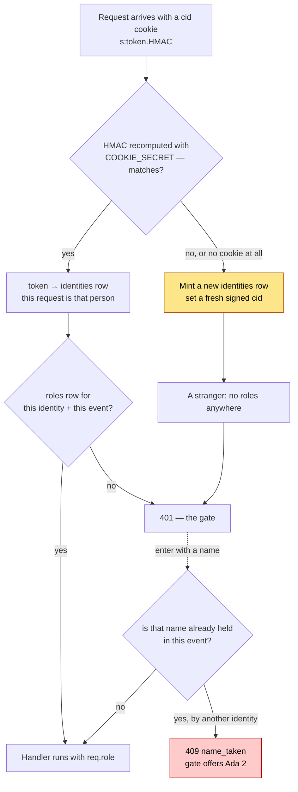
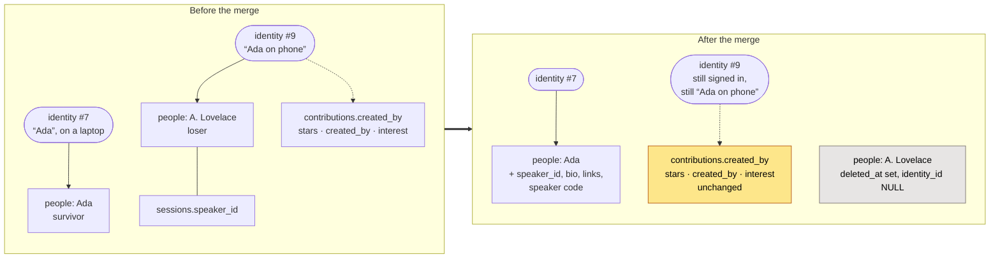

# Architecture

How LibreSesh is put together, and — just as important — what it deliberately
does not do. If you are changing something load-bearing, read the
[Security](#security) section first; several choices that look like gaps are
deliberate, and a few that look harmless are not.

## The shape of it

```
Caddy (:443, automatic HTTPS)
  └── reverse_proxy localhost:3000
        └── one Node process
              ├── Express      API + SSE + static web/dist
              └── better-sqlite3 → $DATABASE_PATH (single file, WAL)
```

One process. One file. No database server, no broker, no queue, no cache. The
whole point is that a conference organiser can run this on a 1 vCPU VPS and back
it up with `cp`.

**Exactly one process may own the database file.** SQLite permits multiple
writers with WAL, but the SSE broker is in-process memory — a second instance
would serve stale schedules to half the room. Never scale the `app` service past
one replica.

## Request path

```
cookie/identity → rate limit → role check → handler → audit + SSE broadcast
```

`server/src/app.ts` wires this in order and the order matters:

- **Identity first**, so even a rejected request is attributable in the audit log.
- **Rate limit before role check**, so password guessing is throttled before it
  can be evaluated.
- **`loadEvent` before `requireRole`**, because a role is per event.
- **`eventAuthRoutes` before `requireRole`** — earning a role has to come before
  requiring one, or the password gate would demand the password it grants.
- **`calendarRoutes` before `requireRole`** — a subscribing calendar app has no
  cookie and authenticates by capability token instead (see below).
- **`/me/link` is global, not event-scoped** — redeeming a link phrase swaps
  the identity cookie itself, so it hangs off `meRoutes` right after the
  identity middleware, before any event exists in the request.

Handlers are synchronous. `better-sqlite3` and `bcryptjs` are both sync, so
Express 4 propagates thrown errors without an async wrapper. `HttpError`
subclasses carry the status and a machine-readable `code`; `errorHandler` shapes
every failure as `{ error: { code, message } }`.

## Data model

| Table | Notes |
| --- | --- |
| `events` | Three bcrypt password hashes, timezone, day viewport, archive flag |
| `identities` | Anonymous cookie token, the display-name seed, optional iCal token |
| `link_codes` | Hashed phrases that adopt an identity: device phrases (single-use, 10 minutes) and admin-minted speaker codes (per person, live until revoked) |
| `event_identities` | `(event, identity) → display name`, unique within the event |
| `roles` | `(identity, event) → viewer\|user\|speaker\|admin` |
| `rooms`, `tags` | Per event, soft-deleted |
| `sessions` | Scheduled: always has a room and a time |
| `proposals` | Pitched: no room, no time, until an organiser places it |
| `people` | Speakers/hosts, optionally claimed by an identity |
| `contributions` | Notes, links, questions; `hidden` for moderation |
| `stars`, `proposal_interest` | Private per-identity interest |
| `audit` | Append-only log of every write |

Times are stored as **UTC ISO-8601 strings**. Every rule that a human would
express in local time — the five-minute snap, the day viewport, the event date
range — is evaluated in the event's IANA timezone via `Intl` in
`server/src/shared/time.ts`. There is no timezone library. Offsets that are not
whole hours (Kathmandu is UTC+05:45) and DST transitions are covered by tests;
do not "simplify" this by comparing UTC minutes.

**Soft deletes everywhere.** `deleted_at` rather than `DELETE`, so an organiser
can undo vandalism (`/trash` and the restore endpoints). A hard delete of a
session would orphan its contributions and stars.

### One database, many events

Every event lives in the same SQLite file, scoped by `event_id`. The obvious
alternative — a database per event — was considered and rejected, because
identity here is deliberately *cross-event*: one signed cookie is one person
across the whole instance, `GET /me` answers with their role in every event,
and the event list is a query. Splitting per event would not remove that shared
state, it would relocate it into a registry database, and then everything that
spans events — the event list, cloning an event's rooms and tags into a new
one, `/trash`, backups, migrations — would have to straddle two connections.

What per-event databases would genuinely buy is isolation, and the isolation
that actually mattered was over names (below), which a schema change bought
outright. Revisit this only if a single instance ever hosts events large or
sensitive enough that physical separation is the requirement — at which point
the answer is probably separate *instances*, not separate files.

### Why a display name belongs to the event, not the identity

A name is how one person is known inside one room. Two unconferences a year
apart have no business fighting over "Ada", so `event_identities` holds the
name and enforces `UNIQUE(event_id, display_name)`;
`identities.display_name` is demoted to the seed a newcomer is offered, and
follows whatever name they last chose.

Global uniqueness was the tempting one-line version — a `UNIQUE` index and a
check in `PATCH /me` — and it is worse than the bug it fixes. It makes the
first person to type a name the owner of it across every event on the instance
forever, including identities nobody uses any more, and it means entering an
event where your name is taken forces you to rename yourself in every *other*
event too.

Two consequences worth knowing:

- **The name is claimed at the gate, before the role is granted.** A clash has
  to leave you outside the event with a name to change, not inside it nameless.
  See `claimEventName` in `server/src/eventIdentity.ts`.
- **It is its own table, not a column on `roles`.** Signing out of an event
  deletes the `roles` row; that must not hand your name to someone else or
  strip the authorship from everything you already posted. `NameResolver` takes
  an event id and resolves against it, so a session's credit follows the name
  its author uses *there*.

### Why proposals are a separate table

A pitch has no room and no time; a session always has both. Making
`sessions.room_id` and `starts_at` nullable would mean either a table rebuild
(SQLite cannot relax `NOT NULL` in place) or placeholder values that every query
then has to special-case. Placing a pitch creates a real session and links the
two, leaving ownership with the pitcher.

### What a cookie is, exactly

Identity is the one concept everything else hangs off, and it is easy to be
vague about. Precisely, then:

**The cookie is `cid`, and it carries the token — the token *is* the identity.**
`identities.token` is 22 random base62 characters and is stored in the database
in clear. Whoever presents it is that person; there is no second factor and no
account. It is a bearer credential, which is why the row is treated as a secret
everywhere else in this document.

**`COOKIE_SECRET` signs that cookie; it does not encrypt it.** Express sets the
cookie's wire value to

```
s:<token>.<base64 of HMAC-SHA256(token) keyed by COOKIE_SECRET, "=" stripped>
```

so the token is plainly readable in the browser's cookie jar, followed by a
signature over it. On each request `cookie-parser` recomputes the HMAC with the
configured secret and compares. The signature answers *"did this server issue
this value"* — it stops someone editing their own cookie to a token they
guessed or stole from a URL — and answers nothing about confidentiality. The
cookie is `httpOnly`, `SameSite=Lax`, `secure` in production, 400 days.

**When the check fails, the request is simply anonymous.** `cookie-parser` puts
`false` (not `undefined`) in `req.signedCookies.cid` for a bad signature, and
`identityMiddleware` treats anything falsy as "no cookie" and mints a fresh
identity. Do not tighten that test to `!== undefined`.

**So changing `COOKIE_SECRET` signs out every visitor at once**, and the damage
does not stop there: their display name is held, uniquely per event, by the
identity they just lost, so they cannot even re-enter under their own name.
That is why an unconfigured secret is generated **once** and kept in
`.cookie-secret` beside the database rather than invented per boot, why
production requires an explicit one, and why the gate offers "Enter as *Ada 2*"
when a name is already taken. `config.cookieSecretOrigin` records which of the
three routes was taken — `env`, `file`, or `ephemeral` — and the boot log warns
loudly about the last one.



Rotating the secret pushes every returning visitor down the yellow branch at
once, and their old names are still held — which is the red box, for everyone,
until they pick a new one.

**What identity is not:** it is not a login, and it is not global state. A role
is a row keyed on (identity, event); a display name is a row keyed on (event,
identity). Signing out of an event deletes the role, never the identity — which
is what lets authorship survive it.

### One person, many devices

A browser identity lives in one cookie jar, so the same human on a phone and a
laptop would be two strangers. The fix is **adoption, not merging**: a link
phrase resolves to an identity, and redeeming it sets that identity's token as
the redeemer's cookie. Both devices are then literally the same `identities`
row, so role, stars, profile and authorship follow with zero migration of data
— there is nothing to reconcile because nothing was ever split.

Two kinds of phrase share the `link_codes` table and the one redemption
endpoint:

| | Device phrase | Speaker code |
| --- | --- | --- |
| Minted by | anyone, from the menu behind their name | organisers, from a person's profile page |
| Shape | three words (~27 bits) | four words (~37 bits) |
| Lifetime | 10 minutes, single use | until revoked, reusable |
| Bound to | the minting identity | a `people` row (`person_id` set) |

All the identity work for a speaker code happens at **mint** time — an
unclaimed person gets a fresh identity, the speaker role, and its display name
claimed — precisely so that redemption stays the same dumb token adoption in
both cases. That is what makes one speaker code work from any number of
devices. Phrases are stored hashed; guesses share the password rate-limit
budget.

### Merging two people

Two rows in `people` can describe one human — an organiser typed "Ada
Lovelace" onto a session while Ada herself claimed a profile as "A. Lovelace".
`POST /people/:id/merge` folds them together. The names in the code are
positional, and worth stating once: **the `:id` in the URL is the survivor**,
the profile that remains; **`from` in the body is the loser**, the duplicate
being folded in and soft-deleted.

What the merge moves is *profile* data. What it does not move is anything keyed
on an **identity** — and that is the distinction the whole feature turns on:



So after a merge, verified against the running app:

- the survivor holds both profiles' sessions and pitches, the identity claim if
  it had none, the bio and links if its own were empty, and the speaker code if
  that code still names the surviving person;
- **the loser's identity keeps everything it wrote**, still under its own event
  display name — so one human's contributions stay split across two names on
  screen;
- **the human on the losing device silently stops owning a profile.** They are
  still signed in and still called what they were called, but nothing in the
  event is `isMine` any more, so they cannot edit the bio that describes them;
- they *can* still delete their own contributions: that is keyed on
  `created_by`, and their identity was never touched.

The obvious fix — re-key the five identity-keyed tables onto the survivor — is
not obviously right, which is why it is still queued rather than done. It would
unify the history under one name, and in the same stroke take away the losing
device's ability to delete words it wrote, because ownership is exactly that
key. The alternative is to make merging an **adoption** the way device linking
is, and adoption cannot be done *to* someone: it swaps a cookie, and only the
holder of that browser can do it.

### The audit log, and what "append-only" means here

Every write appends a row: identity, event, action, entity, entity id, time.
Nothing in the app updates or deletes one — there is no edit path, for
organisers either — and `GET /e/:slug/audit` reads it back into Manage Event →
Audit, keyset-paged because the log only ever grows at the head.

It is bounded, though, and the distinction matters. `events.audit_keep`
(migration 016, default 1000, 0 for unlimited) caps how many rows an event
keeps; past that the oldest are dropped, checked once every hundred writes
rather than on each one. So the log is append-only in the sense that nobody can
rewrite history, and *not* in the sense that history is kept forever: an
organiser who sets a low cap and then makes a great many edits can push an
earlier action off the end. The alternative was unbounded growth on an instance
meant to run for years, and the trade is stated in the UI rather than buried.

Rows with no `event_id` — a whole-database backup, an event created from the
landing page — belong to the instance rather than any event. They are never
pruned by an event's cap, and no screen shows them yet.

### Migrations

Numbered `.sql` files in `server/migrations/`, applied at boot, each in its
own transaction, tracked by filename in the `migrations` table. The runner
(`server/src/db.ts`) enforces three rules that matter once instances run in
the wild:

- **It refuses to run downgraded.** A `migrations` row naming a file not on
  disk means the database belongs to a newer build; booting anyway would fail
  slowly and weirdly. Restore the pre-migration backup to roll back.
- **It snapshots before touching an established database.** `VACUUM INTO`
  `<db>.backup-<stamp>` whenever migrations are pending and at least one has
  ever been applied. Nothing prunes these (yet) — one per upgrade.
- **Rebuilds are supported and verified.** SQLite cannot widen a CHECK or drop
  a NOT NULL in place; the recipe is create-new → copy → drop → rename, which
  needs `foreign_keys` off (a pragma that cannot change mid-transaction, so
  the runner turns it off around the pending files). Every file must leave
  `PRAGMA foreign_key_check` clean or its transaction rolls back. Migrations
  014 (adding the speaker role to two CHECKs) and 015 (making
  `link_codes.expires_at` nullable) are the worked examples.

Prefer additive migrations anyway — `ADD COLUMN … DEFAULT`, new tables,
overrides-only tables like `event_permissions` — and reach for a rebuild only
when the schema genuinely must change shape.

## Realtime

One SSE channel per event slug, held in a `Map<slug, Set<Response>>` in
`server/src/sse.ts`. Every write publishes the fresh entity; clients hold one
bundle and patch it by id, so replaying an event twice is harmless. On
reconnect the client refetches the whole bundle rather than replaying a missed
range — an entire event is one modest JSON payload, and this removes a whole
class of gap-detection bugs.

Heartbeat every 25s. Any proxy in front must keep idle timeouts above that or it
will cut streams; the shipped `Caddyfile` sets 300s.

Stars and proposal interest are **not** broadcast: they are private per
identity, and a broadcast would leak who is going to what.

## Frontend

Vite + React + Tailwind, no state library. `useEventData` holds the bundle in a
reducer and folds SSE changes into it. Two invariants live there: rooms stay
sorted by `sortOrder` (room order *is* the calendar's column order) and tags by
name, because `upsert` alone would silently break the ordering the server
established.

Filters live in the query string so a filtered view is a shareable link.

Markdown is rendered by escaping raw HTML **before** parsing
(`web/src/lib/markdown.ts`), not by sanitising after. Nothing an author writes
can produce markup. Link hrefs are additionally restricted to http/https/mailto.

## Security

### Threat model

This is a **public-ish, low-stakes, high-trust** system: a conference schedule
that a room full of strangers can edit. The assets worth protecting are the
integrity of the programme and the privacy of who is attending what. It is
explicitly *not* built to withstand a targeted attacker with time.

**In scope:**

| Threat | Mitigation |
| --- | --- |
| Guessing an event password | bcrypt (cost 10); 5 attempts per 15 min per identity **and** per IP, `Retry-After` on the 6th |
| Guessing a link phrase | Same 5-per-15-min budget as passwords; stored hashed. Device phrases are single-use and die in 10 minutes; speaker codes are four words (~37 bits) and revocable |
| Casual vandalism of the programme | Soft deletes + restore; `audit` log with identity id, readable by admins at Manage Event → Audit; `hidden` flag for contributions |
| Spam / flooding | Token buckets per identity and per IP on every write class; server-enforced max lengths |
| XSS via session or profile text | HTML escaped before markdown parsing; URL scheme allowlist; no `dangerouslySetInnerHTML` on unescaped input |
| Open redirect | Every client navigation is prefixed with a literal `/e/` |
| Reading a schedule you were not given | Viewing requires the viewer password; there is no public event view |
| Leaking one person's agenda | Stars and interest are never broadcast and never attributed in any payload; only aggregate counts are exposed |
| A leaked calendar URL | The token grants only what its owner's role already allows, and only for that one event; revoking the role kills the feed |
| A leaked whole-database backup | Never leaves the server unencrypted: AES-256-GCM under a scrypt key (N=2^15) from a passphrase typed at download time, gated by the instance password and the 5-per-15-min auth budget |

**Out of scope, accepted:**

- **Shared passwords cannot be revoked per person.** Anyone who learns the admin
  password is an admin until it is changed. Rotating it (admin settings) is the
  only remedy, and it does not evict existing role grants — those are rows in
  `roles`, deliberately, so a rotation does not sign the whole room out mid-event.
- **Identity is a cookie, not a person.** Clearing cookies makes you a new
  attendee. A device-link phrase carries one identity onto a second device, but
  that is continuity, not authentication: whoever types a live phrase becomes
  that person, role included. Impersonation by display name is trivial and not
  defended against. Do not build anything that treats a display name as an
  identity.
- **The database file is the room key.** `identities.token` and `ics_token`
  are stored in clear, so anyone who can read the SQLite file can become any
  attendee (link phrases are hashed only because they transit screens and
  shoulders, not because the DB is distrusted). Accepted deliberately: the
  instance host is trusted, full stop. If that ever stops being true, hash the
  tokens at rest (they are random, so a plain SHA-256 lookup works) rather
  than bolting auth onto the trust boundary.
- **No CSRF tokens.** Cookies are `SameSite=Lax`, which covers the cross-site
  form-post case for the state-changing verbs used here. Any future `GET` that
  mutates state would break that assumption.
- **A determined attacker with a valid password can ruin the schedule.** The
  audit log and restore endpoints are the recovery path, not prevention.

### Things that will bite you

- **`.npmrc` sets `ignore-scripts=true`.** `better-sqlite3` will not build on
  `npm install`. Use `npm run rebuild:native`, or `--ignore-scripts=false` in
  Docker. This is a supply-chain gate; do not remove it to "fix" the build.
- **`COOKIE_SECRET` must be set and stable in production.** Elsewhere an
  unconfigured one is generated once and kept in `.cookie-secret` beside the
  database, because a key that changes per boot invalidates every identity —
  and the failure is worse than it sounds: the visitor comes back a stranger
  *and* cannot reclaim their own display name, which the identity they lost
  still holds. If neither reading nor writing that file works, the boot log
  says the next restart will sign everyone out.
- **`TRUST_PROXY=1` behind a reverse proxy**, or every request appears to come
  from the proxy and the per-IP rate limit becomes a single shared bucket.
- **The instance password gates event creation** and the whole-database
  backup, and is compared in constant time. It is not a user account; it is a
  deploy-level secret.
- **A whole-database backup is a credential, not a document.** It is the file
  the point above calls the room key, so the download encrypts it and the UI
  says so in as many words. The per-event JSON export is the opposite by
  construction — `exportEvent` builds a shape that has nowhere to put a hash or
  a token, rather than filtering secrets out of DTOs, so a new secret column
  cannot leak into it by being added. That asymmetry is deliberate: one file is
  for sharing, the other is for a safe.
- **Rate limits are in-process memory.** They reset on restart and do not span
  instances — which is fine, because there is only ever one instance.

## Testing

Vitest against a temp SQLite file per suite. The suites that matter most are the
permission matrix (`sessions`, `contributions`, `people`, `proposals`), the
timezone maths (`time`), the rate limiter, and the SSE stream — which runs
against a real listening server over a real socket, because the interesting
failures are in framing and buffering, not in the broker's data structures.

`BCRYPT_COST=4` in test config: the algorithm under test is identical, and cost
10 turned a 5-second suite into 30.
